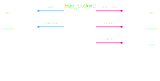

# Buidler Fest 2026 tickets using Tx3

This is an example of how to buy your Buidler Fest 2026 ticket using Tx3.

## TL;DR

If you want to learn about Tx3, we recommend you to follow the tutorial below, it's worthwhile.

If you're in a hurry and just want your ticket, follow the [I don't have time for this shit](tldr.md) version.

## Introduction

You've heard about Tx3 but never had enough time to check it out? Well, this is your chance.

Tx3 is a toolkit for authoring and interacting with UTxO protocols. Think of "UTxO Protocol" as the API to your dApp. The best analogy we have is to think of Tx3 as the "Open API" for blockchain.

In this case, the protocol we want to interact with is the "Buidler Fest Ticketing System". It's a great example for learning Tx3 since it has a little bit of everything, without getting too complex.

## Tutorial

### 1. Install and update the Tx3 toolchain

The first step is to install the toolchain. If you don't have the Tx3 toolchain already installed, follow the [install instructions](https://docs.txpipe.io/tx3/installation) on the documentation site.

Once you're done, you should have a new binary installed called `tx3up`. `tx3up` is our toolchain manager, it takes care of installs and versions of the different components of the Tx3 toolkit.

To make sure you're in the latest version of everything, run:

```bash
tx3up
```

### 2. Clone this repo

This repo contains an implementation of the Ticketing System protocol already finished. You should clone this repo locally to be able to follow the rest of the tutorial.

```bash
git clone https://github.com/txpipe/buidler-fest-2026-buy-ticket
cd buidler-fest-2026-buy-ticket
```

> Tip: all commands below assume you're in the repo root.

The cloned repo has the following project structure:

```
.
├── trix.toml
├── main.tx3
├── .env.mainnet
├── .env.preview
└── onchain/
```

- `trix.toml` - Tx3 protocol configuration file defining metadata and main protocol entry point
- `main.tx3` - Tx3 DSL file describing the ticketing protocol (parties, transactions, constraints)
- `.env.mainnet` - Environment configuration file containing runtime parameters for mainnet network
- `.env.preview` - Environment configuration file containing runtime parameters for preview network
- `onchain/` - Directory containing on-chain smart contract validators written in Aiken

### 3. Meet the protocol: A ticketing system

What we're trying to accomplish is to buy a ticket to attend Buidler Fest 2026. Tickets are represented as Cardano native tokens. Each ticket is an NFT associated to a unique, sequential number. The ownership of this NFT is transferred to the buyer when the transaction is submitted.

This is the diagram that represents the ticket purchase transaction:



We have 3 parties involved in the transaction:

- `buyer`: You, the one who wants to purchase the ticket.
- `issuer`: The script responsible for validating the minting of the ticket NFT.
- `treasury`: A holding account that will receive the ADA for all ticket purchases.

The transaction takes 2 inputs:

- `funds`: This input represents the funds for the ticket purchase and must contain enough ADA to cover the ticket price and transaction fees.
- `current state`: This input contains the current state of the whole registration process (a datum with the current ticket count)

The transaction has 3 outputs:

- `ticket + change`: This output contains the minted ticket NFT and whatever change is left over from the payment.
- `new state`: This output contains the updated state of the registration process (the same datum with an incremented ticket count)
- `payment`: This output contains the ADA for the ticket purchase.

To be accepted on-chain, the tx must respect the following constraints:

- The transaction must pay the ticket price to the treasury.
- The shared state ticket counter must be incremented by exactly 1.
- The ascii name of the ticket asset must be TICKET{x} where {x} is the ticket number.
- Ticket price must be: 400 ADA if submitted before 2026-Feb-01 12:00 UTC.

### 4. Meet the syntax: `main.tx3`

Tx3, among other things, comes with a DSL for describing an UTxO protocol. It allows protocol authors to describe the interface of their system in terms of parties involved, policies and transactions that can be invoked.

> Tip: if you're using VSCode or any of their forks search for the Tx3 VSCode extension, it will provide nice syntax highlighting and LSP features.

Here's the Buidler Fest Ticketing protocol described using the Tx3 DSL:

```tx3
party Buyer;

party Issuer;

party Treasury;

env {
    issuer_beacon_policy: Bytes,
    issuer_beacon_name: Bytes,
    ticket_policy: Bytes,
    issuer_script_ref: UtxoRef,
    ticket_price: Int,
}

type IssuerState {
    ticket_counter: Int,
}

tx buy_ticket() {
    locals {
        issuer_beacon: AnyAsset(issuer_beacon_policy, issuer_beacon_name, 1),
        ticket_name: concat("TICKET", current_state.ticket_counter),
        ticket_token: AnyAsset(ticket_policy, ticket_name, 1),
    }

    validity {
        until_slot: tip_slot() + 600,
    }

    reference issuer_script {
        ref: issuer_script_ref,
    }

    input* funds {
        from: Buyer,
        min_amount: fees + Ada(ticket_price) + min_utxo(ticket),
    }

    input current_state {
        from: Issuer,
        min_amount: issuer_beacon,
        datum_is: IssuerState,
        redeemer: (),
    }

    
    mint {
        amount: ticket_token,
        redeemer: (),
    }

    output ticket {
        to: Buyer,
        amount: funds - fees - Ada(ticket_price) + ticket_token,
    }

    output new_state {
        to: Issuer,
        amount: current_state,
        datum: IssuerState {
            ticket_counter: current_state.ticket_counter + 1,
        },
    }

    output payment {
        to: Treasury,
        amount: Ada(ticket_price),
    }

    collateral {
        from: Buyer,
        min_amount: fees,
    }
}
```

Key ideas worth noticing:

- **Parties**: `Buyer`, `Issuer`, and `Treasury` describe who interacts with the UTxOs. Tx3 keeps them explicit so scripts and clients know the expected roles.
- **Environment**: everything under `env { ... }` are parameters the protocol expects at runtime. For example, `ticket_policy` is pulled in when building the transaction, not hardcoded. This allows you to have a single .tx3 that is compatible with different contexts (eg: mainnet vs preview).
- **UTxOs as State**: `IssuerState` keeps a counter so each ticket name is unique. Tx3 uses typed datums so you don't get lost in opaque blobs. Notice that the state of the protocol is being retrieved at runtime, allowing you to describe your protocols as a derivation of the dynamic state on-chain.
- **Transaction as functions**: `tx buy_ticket()` declares inputs, outputs, minting, and validity window. The DSL is strongly typed and keeps the flow readable (no more scrolling through JSON by hand). The goal is that to treat your protocol as a set of tx functions that express the user intents.
- **Custom expressions**: notice that there's no hardcoded value or parameter that you need to pass. Tx3 gives you basic primitives and operators that allows you to describe your outputs as expressions over the state and parameters.
- **Strongly Typed**: `IssuerState` is an example of a custom type that enforces the shape of datums, redeemers and other data structures in the protocol.

### 5. Generate the unsigned transaction with `trix`

We're going to ask `trix` to build the ticket purchase transaction for mainnet, but **not** submit it yet. That way you can sign it in your wallet of choice.

From the repo root, run:

```bash
trix invoke --profile mainnet --skip-submit
```

What happens next:

1. `trix` compiles `main.tx3`, loads the `mainnet` profile, and asks for any runtime params (like your buyer address). The `.env.mainnet` file contains the environment values for `mainnet`.
2. You'll be prompted for `buyer`. Paste the address of the wallet you want to use to pay. Make sure it holds **at least 400 ADA** for the ticket plus fees.
3. `trix` assembles the transaction using the protocol definition, including the minting of your unique `TICKET#` asset and the payment to the treasury.
4. Because we passed `--skip-submit`, the tool spits out a JSON payload with the unsigned CBOR and its hash, something like:

   ```json
   {
     "cbor": "84a900...00f5f6",
     "hash": "270199...61ba43"
   }
   ```

The `cbor` field is the raw unsigned transaction. Copy it all—no whitespace trimming, no extra quotes.

> Want to see more flags or profiles? Check the [Tx3 CLI docs](https://docs.txpipe.io/tx3/tooling/trix) for all the knobs.

### 6. Sign and submit from your wallet

Tx3 intentionally stops short of signing for you—that part is on your wallet so you keep control of keys. Use any wallet that supports CBOR import. The flow is usually:

1. Open the wallet's "Import unsigned transaction" or "Submit CBOR" option.
2. Paste the `cbor` value you just copied.
3. Review the transaction details: you should see ~400 ADA leaving and a fresh `TICKET#` native asset coming back to you.
4. Approve, sign, and submit.

If everything goes well, the wallet will show the transaction hash and your fresh ticket asset. The `hash` printed by `trix` is your pre-sign hash—handy for double-checking you're signing what you built.

###  7. Complete the KYC

Make sure you complete our [KYC form](https://forms.gle/ziKXTWdz9oefm2DP8) to complete the registration once you finish your purchase transaction.

## What's next?

Want to go deeper? The [official Tx3 docs](https://docs.txpipe.io/tx3) cover the DSL, standard library, and more involved protocol patterns. Once you've bagged your ticket, try tweaking `main.tx3` and see how `trix` reacts—it's a great way to learn.

Happy minting and see you at Buidler Fest!
